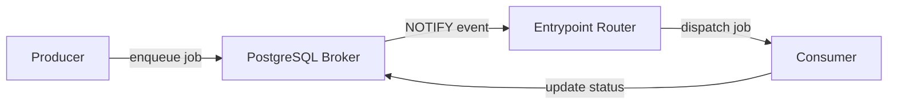
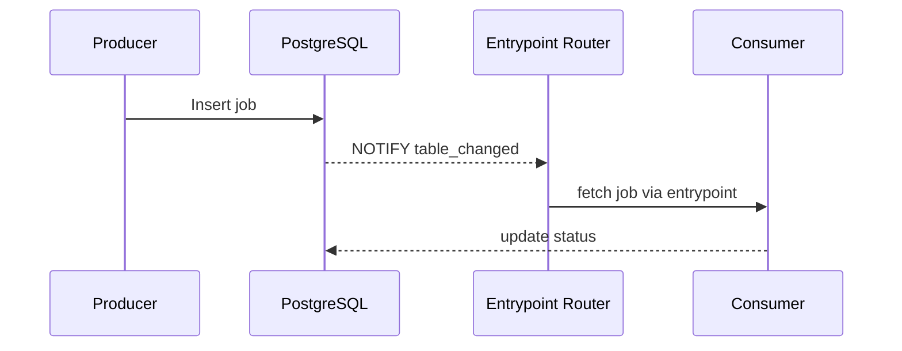

# Architecture

This overview explains how data flows from a producer to a consumer in PGQueuer.
It highlights how entrypoints route jobs and how PostgreSQL notifications keep
consumers up to date.

## Component Diagram

The diagram below illustrates the main components involved in job processing.

## Sequence Diagram

1. **Producer** calls the enqueue API, inserting a job into PostgreSQL.
2. The database emits a **NOTIFY** event on the configured channel.
3. The **Entrypoint Router** receives the event and dispatches the job
   to the correct consumer function.
4. After processing, the **Consumer** updates job status back in PostgreSQL.

Endpoint routing is handled by `EventRouter` which maps notification types to
functions registered via `@pgq.entrypoint`. Notifications delivered through
`LISTEN/NOTIFY` ensure consumers promptly react to new work.
