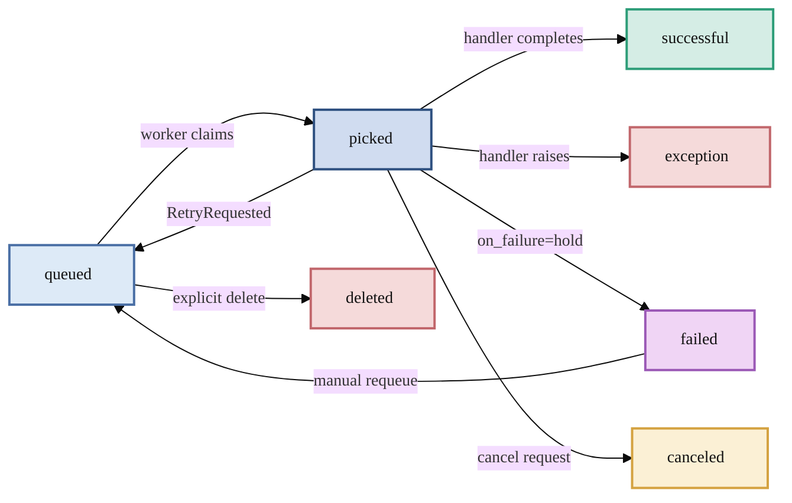

# Core Concepts

This page explains the key abstractions in PgQueuer. Understanding these will help you
make the most of every feature.

---

## Jobs

A **job** is a unit of work stored as a row in the `pgqueuer` table. Each job has:

| Field | Type | Purpose |
|-------|------|---------|
| `id` | `int` | Auto-incrementing primary key |
| `entrypoint` | `str` | Which handler should process this job |
| `payload` | `bytes \| None` | Arbitrary data passed to the handler |
| `priority` | `int` | Higher values are dequeued first |
| `status` | enum | Current lifecycle state (see below) |
| `execute_after` | `timestamp` | Earliest time the job can be picked up |
| `attempts` | `int` | Number of previous retry attempts (starts at 0) |
| `heartbeat` | `timestamp` | Last time the worker confirmed it is alive |
| `dedupe_key` | `str \| None` | Optional unique key to prevent duplicate enqueuing |

Jobs are created by calling `Queries.enqueue()` and processed by functions registered
with `@pgq.entrypoint()`.

---

## Entrypoints

An **entrypoint** is a named async handler that processes jobs. All entrypoints must be
defined with `async def`. You register entrypoints using the `@pgq.entrypoint()` decorator:

```python
@pgq.entrypoint("send_email")
async def send_email(job: Job) -> None:
    # process the job
    ...
```

When a job with `entrypoint="send_email"` is dequeued, PgQueuer calls this function.

### Entrypoint Parameters

The `@entrypoint()` decorator accepts several parameters that control how jobs are processed:

| Parameter | Type | Default | Effect |
|-----------|------|---------|--------|
| `name` | `str` | (required) | Entrypoint name -- must match what producers enqueue |
| `requests_per_second` | `float` | `inf` | Max throughput for this entrypoint |
| `concurrency_limit` | `int` | `0` (unlimited) | Max simultaneous jobs for this entrypoint |
| `serialized_dispatch` | `bool` | `False` | Process jobs one at a time (equivalent to `concurrency_limit=1`) |
| `retry_timer` | `timedelta` | `0` (disabled) | Re-queue jobs whose heartbeat has gone stale |
| `accepts_context` | `bool` | `False` | Pass a `Context` object as the second argument |
| `on_failure` | `"delete" \| "hold"` | `"delete"` | Hold failed jobs for manual re-queue instead of deleting |
| `executor_factory` | callable | `None` | Custom executor class for retry logic, etc. |

---

## Job Status Lifecycle

Every job transitions through a series of states. The status is stored as the
`pgqueuer_status` PostgreSQL enum with seven values:



| Status | Meaning |
|--------|---------|
| `queued` | Waiting to be picked up by a worker |
| `picked` | A worker has claimed this job and is processing it |
| `successful` | Handler completed without raising an exception |
| `exception` | Handler raised an unhandled exception (traceback is logged) |
| `failed` | Job held for manual review after terminal failure (see [Holding Failed Jobs](../guides/hold-failed-jobs.md)) |
| `canceled` | Job was canceled via `mark_job_as_cancelled()` |
| `deleted` | Job was removed before being processed |

Once a job reaches a terminal state (`successful`, `exception`, `canceled`, `deleted`),
it is moved from the `pgqueuer` table to the `pgqueuer_log` table as an audit record.
Jobs with status `failed` remain in the queue table until manually re-queued or deleted.

---

## Schedules

A **schedule** is a cron-style recurring task. Schedules are stored in the
`pgqueuer_schedules` table and managed by the `SchedulerManager`.

```python
from pgqueuer.models import Schedule

@pgq.schedule("hourly_report", "0 * * * *")
async def hourly_report(schedule: Schedule) -> None:
    print("Generating report...")
```

PgQueuer supports standard 5-field cron expressions (minute-level) and 6-field expressions
with a trailing seconds field for sub-minute scheduling. The scheduler uses `FOR UPDATE
SKIP LOCKED` to ensure only one worker runs each scheduled task, even across multiple
processes.

See [Scheduling](../guides/scheduling.md) for full details.

---

## Drivers

A **driver** wraps a database connection and provides PgQueuer with a uniform interface
for executing queries and listening for notifications. PgQueuer includes these drivers:

| Driver | Connection Type | Use Case |
|--------|----------------|----------|
| `AsyncpgDriver` | Single `asyncpg.Connection` | Workers (recommended) |
| `AsyncpgPoolDriver` | `asyncpg.Pool` | Producers or high-throughput scenarios |
| `PsycopgDriver` | `psycopg.AsyncConnection` | Async psycopg applications |
| `SyncPsycopgDriver` | `psycopg.Connection` | Sync scripts and Django views |
| `InMemoryDriver` | None | Tests and CI without PostgreSQL |

Factory classmethods on `PgQueuer` simplify setup:

```python
# asyncpg single connection
pgq = PgQueuer.from_asyncpg_connection(conn)

# asyncpg pool
pgq = PgQueuer.from_asyncpg_pool(pool)

# psycopg async connection
pgq = PgQueuer.from_psycopg_connection(conn)

# In-memory (no database)
pgq = PgQueuer.in_memory()
```

See [Drivers](../reference/drivers.md) for detailed guidance.

---

## QueueManager and SchedulerManager

These are the two runtime engines inside `PgQueuer`:

- **`QueueManager`** -- listens for NOTIFY events, dequeues job batches with
  `FOR UPDATE SKIP LOCKED`, dispatches them to registered entrypoints, and updates
  job status.

- **`SchedulerManager`** -- polls the `pgqueuer_schedules` table, checks which cron
  expressions are due, and executes the corresponding registered functions.

When you call `pgq run myapp:main`, both managers run concurrently in the same
asyncio event loop.

---

## Database Tables

PgQueuer creates four tables:

| Table | Purpose |
|-------|---------|
| `pgqueuer` | Active job queue -- rows are INSERT'd by producers and UPDATE'd/DELETE'd by workers |
| `pgqueuer_log` | Append-only audit trail of completed jobs (with traceback for failed jobs) |
| `pgqueuer_statistics` | Aggregated processing statistics per entrypoint |
| `pgqueuer_schedules` | Cron schedule definitions and last-run timestamps |

See [Database Setup](../reference/database-setup.md) for full schema details and
[Database Permissions](../reference/database-permissions.md) for minimal privilege grants.

---

## Next Steps

Now that you understand the building blocks:

- **[Scheduling](../guides/scheduling.md)** -- set up cron-style recurring tasks
- **[Rate Limiting](../guides/rate-limiting.md)** -- throttle job execution
- **[Reliability](../guides/reliability.md)** -- retries, idempotency, and audit trails
- **[Deployment](../guides/deployment.md)** -- run workers in production
