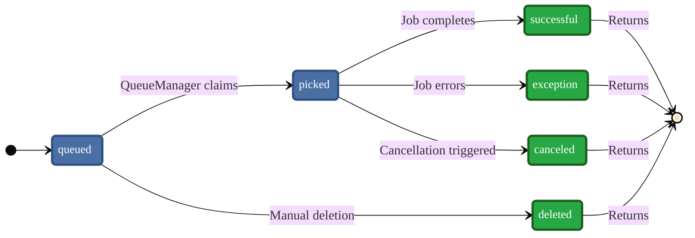

# Completion Tracking

`CompletionWatcher` lets you **await** the final status of any job, live-streamed via
PostgreSQL `LISTEN/NOTIFY`, with zero manual polling.

## Parameters

| Parameter | Type | Default | Purpose |
|-----------|------|---------|---------|
| `refresh_interval` | `timedelta \| None` | **5 s** | Safety-net poll in case a `NOTIFY` was lost |
| `debounce` | `timedelta` | **50 ms** | Coalesces bursts of `NOTIFY`s to reduce query load |

## Basic Usage

```python
from pgqueuer.completion import CompletionWatcher

async with CompletionWatcher(driver) as watcher:
    status = await watcher.wait_for(job_id)
    # status: "successful", "exception", "canceled", or "deleted"
```

### Completion Watcher State Flow

The watcher monitors a job's progression until it reaches a **terminal state**:



## Tracking Many Jobs at Once

```python
from asyncio import gather
from pgqueuer.completion import CompletionWatcher

image_ids   = await qm.queries.enqueue(["render_img"]   * 20, [b"..."] * 20, [0] * 20)
report_ids  = await qm.queries.enqueue(["generate_pdf"] * 10, [b"..."] * 10, [0] * 10)
cleanup_ids = await qm.queries.enqueue(["cleanup"]      *  5, [b"..."] *  5, [0] *  5)

async with CompletionWatcher(driver) as w:
    img_statuses, pdf_statuses, clean_statuses = await gather(
        gather(*[w.wait_for(j) for j in image_ids]),
        gather(*[w.wait_for(j) for j in report_ids]),
        gather(*[w.wait_for(j) for j in cleanup_ids]),
    )
```

Terminal states: `canceled`, `deleted`, `exception`, `successful`.

## Helper Patterns

Below are two ready-to-use patterns you can copy into your own code for common
completion-tracking scenarios.

### Wait for all jobs

Block until every supplied job finishes; return statuses in the same order as the input IDs.

```python
import asyncio
from datetime import timedelta
from pgqueuer import db, models
from pgqueuer.completion import CompletionWatcher


async def wait_for_all(
    driver: db.Driver,
    job_ids: list[models.JobId],
    refresh_interval: timedelta = timedelta(seconds=5),
    debounce: timedelta = timedelta(milliseconds=50),
) -> list[models.JOB_STATUS]:
    async with CompletionWatcher(
        driver,
        refresh_interval=refresh_interval,
        debounce=debounce,
    ) as watcher:
        waiters = [watcher.wait_for(jid) for jid in job_ids]
        return await asyncio.gather(*waiters)
```

### Wait for first job

Return as soon as **any** job hits a terminal state; cancel pending waiters.

```python
async def wait_for_first(
    driver: db.Driver,
    job_ids: list[models.JobId],
    refresh_interval: timedelta = timedelta(seconds=5),
    debounce: timedelta = timedelta(milliseconds=50),
) -> models.JOB_STATUS:
    async with CompletionWatcher(
        driver,
        refresh_interval=refresh_interval,
        debounce=debounce,
    ) as watcher:
        waiters = [watcher.wait_for(jid) for jid in job_ids]
        done, pending = await asyncio.wait(
            waiters, return_when=asyncio.FIRST_COMPLETED
        )
        for fut in pending:
            fut.cancel()

    return next(iter(done)).result()
```

## Notification Reliability

To maximise reliability without heavy polling:

1. **Listener health check** — Enable `--shutdown-on-listener-failure` on the `QueueManager`
   so it stops (and can be restarted by a supervisor) if the LISTEN channel becomes unhealthy.

2. **Disable the refresh poll** — Set `refresh_interval=None` to rely solely on notifications
   when your channel is stable:

    ```python
    async with CompletionWatcher(driver, refresh_interval=None) as w:
        status = await w.wait_for(job_id)
    ```
