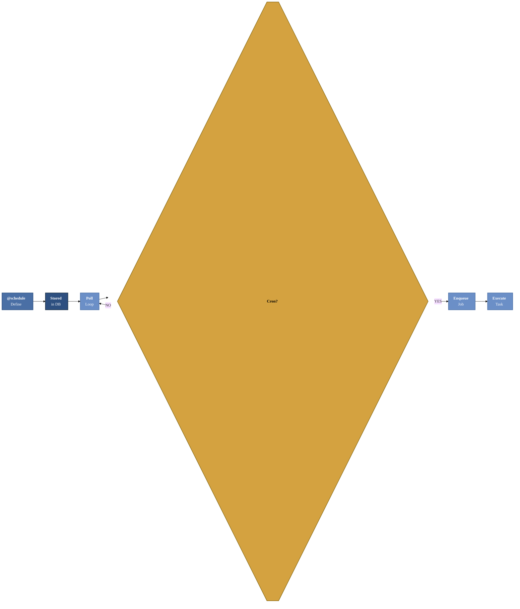

# Scheduling

PgQueuer includes a built-in scheduler for managing recurring tasks using cron-like expressions.
No separate process (like `celery-beat`) is required.

## Basic Usage

```python
from pgqueuer.models import Schedule

@pgq.schedule("fetch_db", "* * * * *")
async def fetch_db(schedule: Schedule) -> None:
    await perform_task()
```

## How It Works

- **Registration**: Define tasks using the `@schedule` decorator with a name and a cron expression.
- **Execution**: The scheduler runs tasks at defined intervals and tracks execution state.
- **Database Integration**: Schedules are stored in PostgreSQL, ensuring durability and recovery
  across process restarts.

### Scheduler Flow Diagram



## Cron Expression Format

PgQueuer uses standard 5-field cron expressions:

```
┌───────────── minute (0–59)
│ ┌───────────── hour (0–23)
│ │ ┌───────────── day of month (1–31)
│ │ │ ┌───────────── month (1–12)
│ │ │ │ ┌───────────── day of week (0–6, Sunday=0)
│ │ │ │ │
* * * * *
```

Examples:

| Expression | Meaning |
|------------|---------|
| `* * * * *` | Every minute |
| `*/5 * * * *` | Every 5 minutes |
| `0 * * * *` | Every hour |
| `0 9 * * 1` | Every Monday at 9:00 AM |
| `0 0 1 * *` | First day of each month at midnight |

## Cleaning Up Old Schedules

When `clean_old=True`, PgQueuer deletes any **existing** database schedules whose entrypoint
matches this decorator's entrypoint before re-registering it. This is useful when you change
the cron expression for a task and want the old schedule row replaced on startup.

```python
@pgq.schedule("fetch_db", "* * * * *", clean_old=True)
async def fetch_db(schedule: Schedule) -> None:
    await perform_task()
```

By default, `clean_old=False` — old schedules are retained.

## Managing Schedules via CLI

List all schedules:

```bash
pgq schedules
```

Remove a schedule by name:

```bash
pgq schedules --remove fetch_db
```

## Example: Full Setup with Scheduling

```python
from datetime import datetime
import asyncpg
from pgqueuer import PgQueuer
from pgqueuer.models import Job, Schedule

async def main() -> PgQueuer:
    connection = await asyncpg.connect()
    pgq = PgQueuer.from_asyncpg_connection(connection)

    @pgq.entrypoint("process_job")
    async def process_job(job: Job) -> None:
        print(f"Processing: {job!r}")

    @pgq.schedule("hourly_report", "0 * * * *")
    async def hourly_report(schedule: Schedule) -> None:
        print(f"Generating report at {datetime.now()}")

    @pgq.schedule("daily_cleanup", "0 2 * * *", clean_old=True)
    async def daily_cleanup(schedule: Schedule) -> None:
        print(f"Running cleanup at {datetime.now()}")

    return pgq
```

```bash
pgq run myapp:main
```
