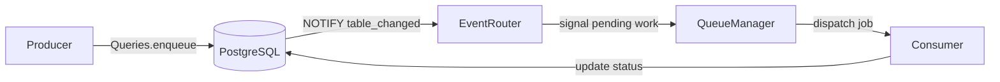
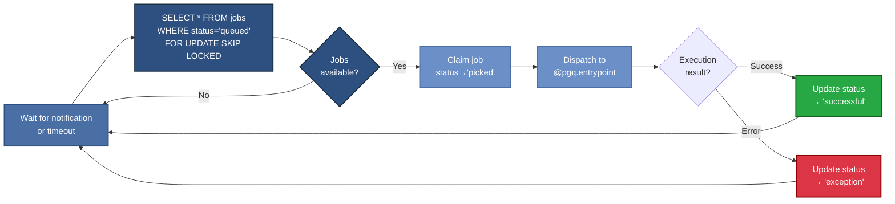
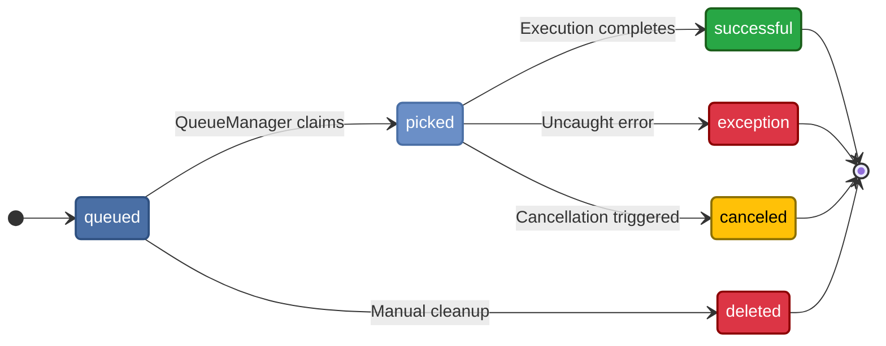

# Architecture

This overview explains how data flows from a producer to a consumer in PGQueuer.
It highlights how entrypoints route jobs and how PostgreSQL notifications keep
consumers up to date.

## Job Flow Diagram



1. **Producer** inserts a job using `Queries.enqueue()`.
2. A trigger emits a `table_changed_event` via **NOTIFY** on the configured channel.
3. The **EventRouter** places the event in a `PGNoticeEventListener` queue.
4. The **QueueManager** waits for events, fetches ready jobs with `FOR UPDATE SKIP LOCKED`, and dispatches them to registered entrypoints.
5. After execution, the **Consumer** updates job status back in PostgreSQL.

Endpoint routing is handled by `EventRouter` which maps notification types to
functions registered via `@pgq.entrypoint`. Notifications delivered through
`LISTEN/NOTIFY` ensure consumers promptly react to new work.

## QueueManager Processing Loop



## Job Status Lifecycle

PGQueuer tracks each job's progress using a dedicated PostgreSQL ENUM type,
`pgqueuer_status` by default:

```sql
CREATE TYPE pgqueuer_status AS ENUM (
    'queued',
    'picked',
    'successful',
    'exception',
    'canceled',
    'deleted'
);
```

The lifecycle of a job flows through these statuses:

- **`queued`** — Newly enqueued jobs start here and wait for a worker to pick them up.
- **`picked`** — Set by `QueueManager` when a worker begins processing. A heartbeat
  timestamp tracks active work.
- **`successful`** — Assigned after a job completes without errors. Details are copied to
  the statistics log and removed from the queue.
- **`exception`** — Indicates the job failed with an uncaught error. The traceback is
  stored for later inspection.
- **`canceled`** — Jobs canceled before completion receive this status and are logged.
- **`deleted`** — Used when jobs are removed from the queue without running, such as during
  manual cleanup operations.

### Status Transition Diagram


